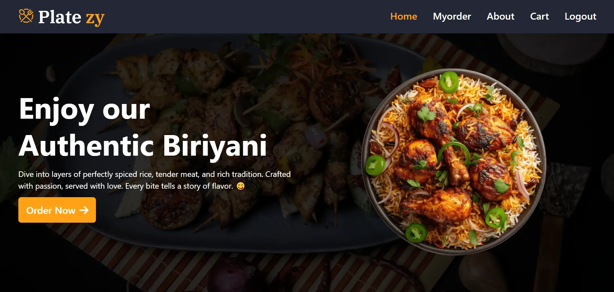
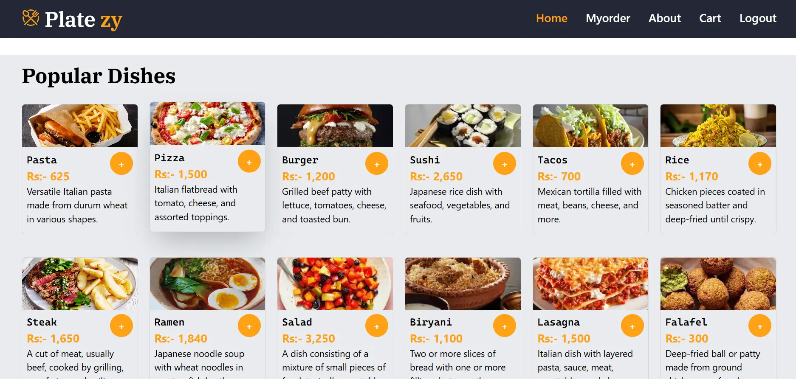
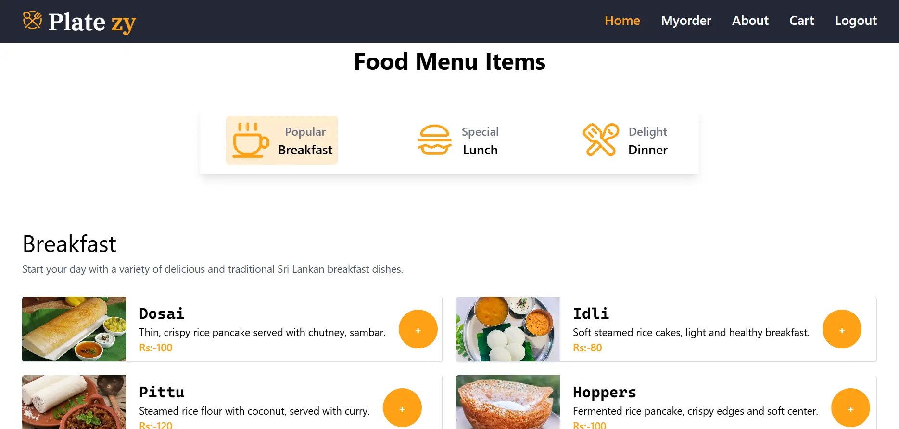
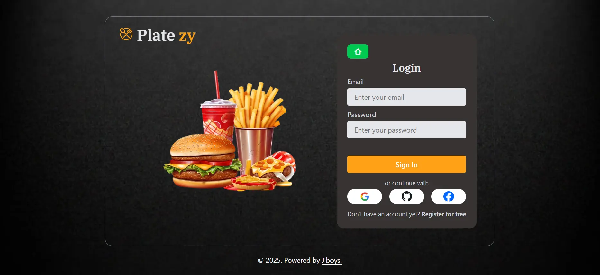
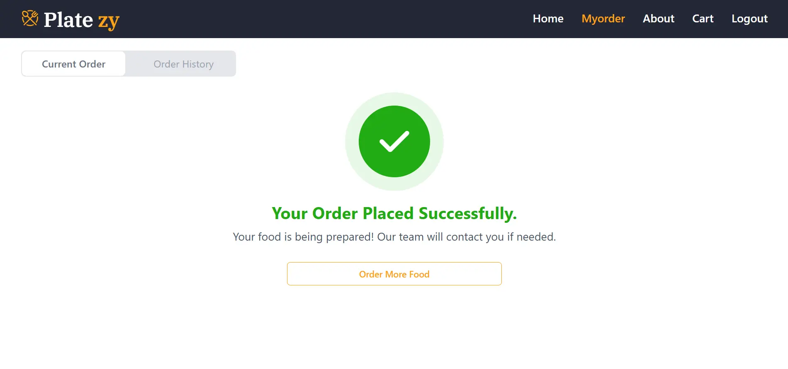
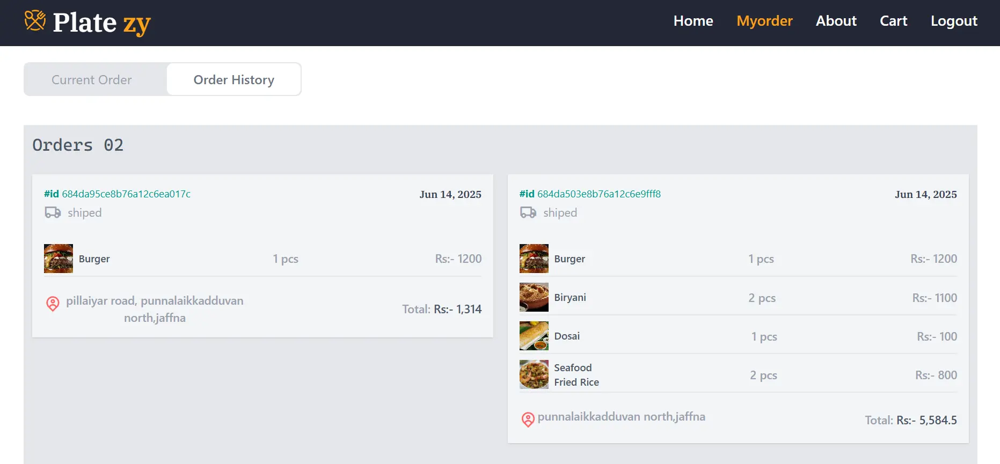
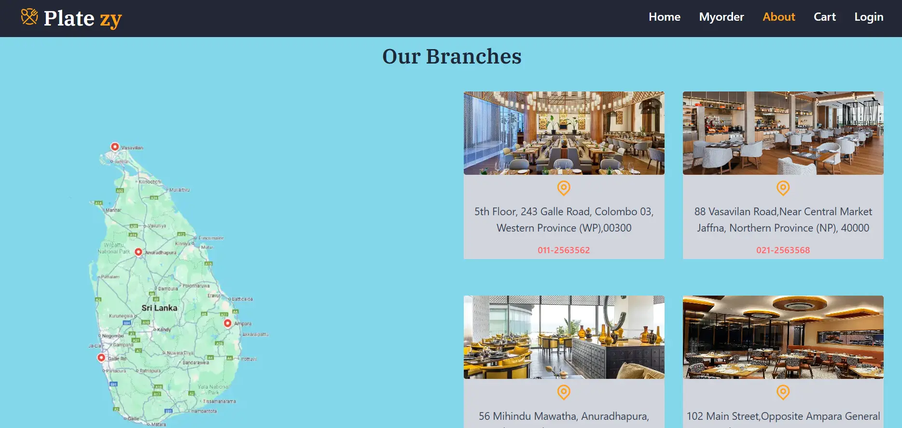
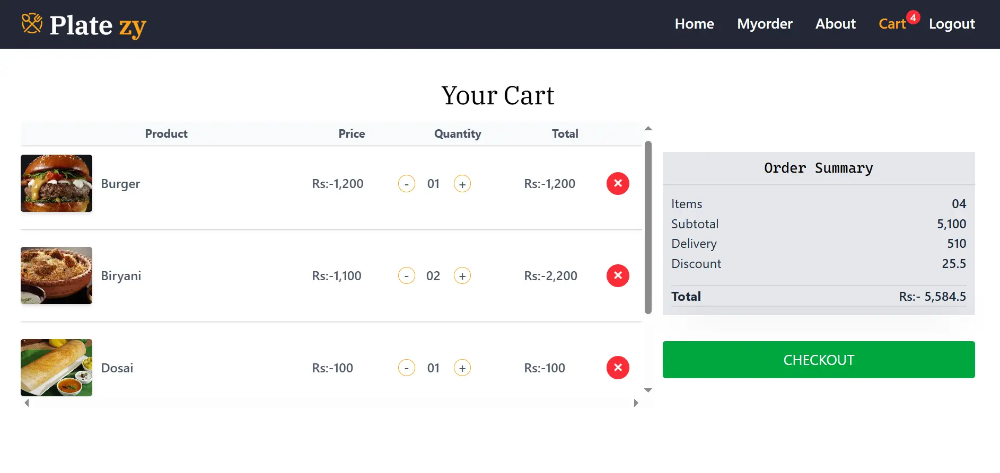
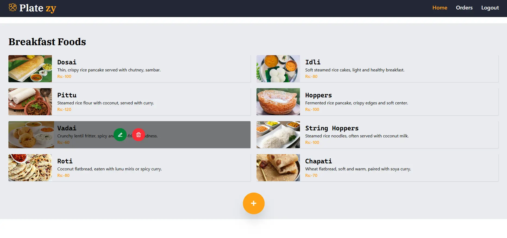
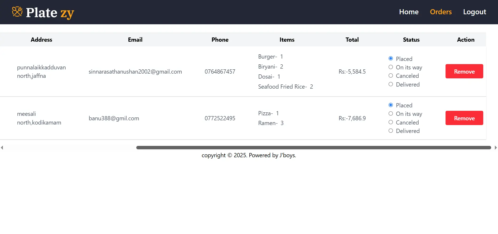

# Platezy - Smart & Speedy Food Delivery

Platezy is a full-stack MERN (MongoDB, Express, React, Node.js) food delivery application that connects users to their favorite local restaurants with fast, reliable delivery. The project features a modern frontend, robust backend, and an admin dashboard for managing food items and orders.

---

## Table of Contents

- [Features](#features)
- [Screenshots](#screenshots)
- [Tech Stack](#tech-stack)
- [Project Structure](#project-structure)
- [Getting Started](#getting-started)
- [Usage](#usage)
- [API Documentation](#api-documentation)
- [Contributing](#contributing)
- [License](#license)

---

## Features

- User authentication (login/register)
- Browse food categories (breakfast, lunch, dinner, popular)
- Add items to cart and place orders
- Order confirmation and email notification
- Admin dashboard for managing menu and orders
- Responsive design for mobile and desktop
- Customer reviews and gallery

---

## Screenshots

**User**

<p align="center">
  
  
  
  
  
  
  
  
</p>

**Admin**


  

## Tech Stack

- **Frontend:** React, Tailwind CSS, React Router, Redux, Framer Motion, Swiper, SweetAlert2
- **Backend:** Node.js, Express.js, MongoDB, Mongoose
- **Authentication:** Firebase
- **Email Service:** EmailJS

---

## Project Structure

```
LICENCE
README.md
Backend/
  Controllers/
  Models/
  Routes/
  .env
  package.json
  server.js
Frontend/
  public/
  src/
    Componets/
    Pages/
    Firebase.js
    main.jsx
  index.html
  package.json
```

---

## Getting Started

### Prerequisites

- Node.js & npm
- MongoDB instance (local or cloud)
- Firebase project for authentication

### Backend Setup

1. Go to the `Backend/` directory:
   ```sh
   cd Backend
   ```
2. Install dependencies:
   ```sh
   npm install
   ```
3. Create a `.env` file with your MongoDB URI and other secrets.

4. Start the server:
   ```sh
   npm start
   ```

### Frontend Setup

1. Go to the `Frontend/` directory:
   ```sh
   cd Frontend
   ```
2. Install dependencies:
   ```sh
   npm install
   ```
3. Configure Firebase in `src/Firebase.js`.

4. Start the development server:
   ```sh
   npm run dev
   ```

---

## Usage

- Visit the home page to browse food items.
- Register or log in to place orders.
- Admins can log in to manage menu and orders.

---

## API Documentation

You can find the full API documentation and test endpoints using Postman:

[](https://documenter.getpostman.com/view/41049800/2sB34bM3wF)

## Contributing

Pull requests are welcome! For major changes, please open an issue first to discuss what you would like to change.

---

## License

This project is licensed under the MIT License. See the [LICENCE](LICENCE) file for details.

---

> © 2025 Platezy. Powered by [S.Thanushan.](https://thanushan-dev.vercel.app/)
